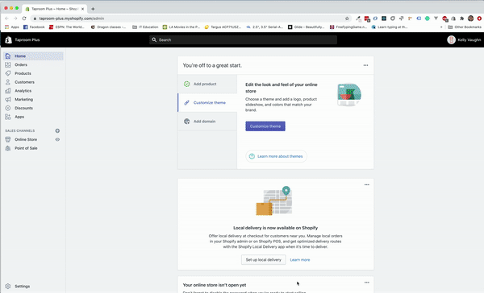

# Build Process

This build process aims to be an agnostic way to ensure modern features in our
Shopify projects. It is entirely opt-in. This enables it to be dropped into an
existing theme but only affect new files created in the scripts/styles folders.
Any old assets wouldn't be converted to build process unless explicitly done so.
This also allows one to 'opt-out' of the process during development if needed.
so at any point, a file can be moved back to `assets`, `theme.liquid` file
reference updated, and theme deployed to circumvent the build process.

## Overview

### Scripts and Styles folders

The root directory for these folders will be iterated through on build. Each file
located in root will have an equitable `.min` file created for it in the assets
folder. This separation provides the opportunity to only load the scripts and styles
needed for a specific page instead of requiring all assets for the entire site at
one time. For the components that need to be on every page, you can do this by
creating a subdirectory in the `scripts` or `styles` folder and importing it to
a `main.scss`/`theme.scss`/`index.js`/`theme.js` file in the root of the parent
directory.

The build process is possible because these are javascript and scss files, 
not `.liquid` files. Liquid in the build process files will keep it from
working. If `.js.liquid`, `.css.liquid` or `.scss.liquid` files need to be moved
over, please follow [this process](./setup-docs/liquid-settings-for-js-css.md) for sanitizing the files of liquid and
referencing them in a way the build process can handle.

### File Structure

Potential file structure for a project:

``` html
|-- YourProject
    |-- assets
        |-- index.min.js
        |-- my-page.min.js
        |-- product.min.js
        |-- main.min.css
        |-- my-page.min.css
        |-- product.min.css
    |-- config
    |-- layout
        | theme.liquid (references .min files in assets)
    |-- locales
    |-- scripts
        |-- components
            |-- header.js
        |-- index.js (includes header.js)
        |-- my-page.js
        |-- product.js
    |-- snippets
    |-- styles
        |-- components
            |-- header.scss
        |-- main.scss (includes header.scss)
        |-- my-page.scss
        |-- product.scss
    |-- templates

```
## Store Setup

1. Create a Shopify Partners account (https://partners.shopify.com)
2. Create a development store (https://help.shopify.com/en/partners/dashboard/managing-stores/development-stores#create-a-development-store-for-testing-apps-or-themes)
3. Import product.csv (creates products + collections) (https://help.shopify.com/en/manual/products/import-export/import-products)
4. Head to Online Store > Customize. In the Theme Customizer, select the collection called "Featured" as the Collection in the "Featured collection" block and save.
5. Download the Shopify theme to your computer (https://help.shopify.com/en/manual/online-store/legacy/using-themes/managing-themes/downloading-themes)
6. Set up the development environment using our build process. (https://github.com/the-taproom/build-process.git) Follow "Setup in Existing Project" steps.
7. Edit the Debut theme (default published theme) to make the following changes:
8. Add a "Buy Now" button to the product loop in the Featured Collection section. The button should appear when you hover over the product's image. (During your pair programming session, you'll link that Buy Now button to add that item to the cart via Ajax.)
9. Create a new FAQs section. The section should have a title and blocks for question and answer. When you click on a question, the answer's visibility should toggle. We're not testing you on your liquid; we want to see how you write the JavaScript to make the questions toggle to show the answer, and we want to see how you style it for desktop and mobile. 
10. For this part of the interview process, we're looking at your HTML, CSS, and JavaScript - is it semantic, is it clean, is it mobile-friendly, are you using best practices when writing your code. We also want to see your commit history; we're looking for clarity on how you communicate the changes you're making as requested.
11. You'll have one week to complete this; the sooner you can get the test back to us, the sooner we can schedule your next interview.

## Build Process Setup in Existing Theme

1. Clone this repo
2. (If needed) Install bundler 2 - `gem install bundler`  
3. Install gems - `bundle install`
4. Run `ruby build_process_app.rb migrate [PATH_TO_PROJECT/THEME_DIRECTORY]`(where you
   downloaded the theme) to copy files from `build-process-files` to the directory of your project
5. Move to the folder of the theme you downloaded
6. Add `main.scss` to `styles` folder

(Optional)
7. Add `index.js` to `scripts` folder

### Next Steps

1. Add snippet `css-variables.liquid` to snippets folder
    - This file allow us to sanitize our scss files from any liquid 

Code for file: 
```


:root {
--color-body-text: {{ settings.color_body_text }};
--color-background: {{ settings.color_background_color }}
}


<style>
  :root {
    --color-black: #000000;
    --color-white: #ffffff;
  }
</style>
```

2. Add snippet `js-variables.liquid` to snippets folder
    - This file allow us to sanitize our javascript files from any liquid 

Code for file: 
```

  <script>
  Shopify = window.Shopify || {};
   /* # Theme settings
  ================================================== */ 
  Shopify.theme_settings = {};
   Example: 
   Cart 
  Shopify.theme_settings.display_tos_checkbox = {{ settings.display_tos_checkbox | json }};
  Shopify.theme_settings.go_to_checkout = {{ settings.go_to_checkout | json }};
  Shopify.theme_settings.cart_action = {{ settings.cart_action | json }};
  
  </script>





  
  
    {{ variableblock }}
  
    {{ variableblock | prepend: 'Shopify.' }}
  

```

2. Add code for css and js variables to `theme.liquid` in the `head`.
```
 
```

```
 
```

3. Run npm install (or yarn install)
4. Make sure Shopify tooling is installed
- `brew tap shopify/shopify`
- `brew install themekit`
5. Install Gulp CLI
- `npm install gulp-cli -g`
6. Build minified files
- `npm run build`
7. Include minified files in `theme.liquid`
- `{{ 'main.min.css' | asset_url | stylesheet_tag }}`
- `{{ 'index.min.js' | asset_url | script_tag }}`

## Commands

* `npm run start`        - Starts Gulp watcher on `scripts` and `styles` directories.
* `npm run build`        - Gulp builds the .min files from `scripts` and `styles`, but doesn't watch.
* `npm run watch`        - Runs theme deploy and theme watch on development config.
* `npm run test`         - Runs Cypress open and will start any tests.
* `npm run deploy-dev`   - Runs `theme deploy --env=development`
* `npm run deploy-stage` - Runs `theme deploy --env=staging`

## Themkit Setup

To build this project:

1. Clone repo locally

2. Install Shopify tooling:
   **Using Homebrew**

   - `brew tap shopify/shopify`
   - `brew install themekit`

3. Install [Themekit](https://shopify.github.io/themekit/)

4. Run `npm install`

5. Set up config.yml
  - Note: `settings_data` and `settings_schema` are ignored in snippet below. If you
    are adding to them from code, uncomment by replacing `-` with `#`.

``` yaml
# Password, theme_id, and store variables are required.
#
# For more information on this config file:
# https://shopify.github.io/themekit/commands/#configure

development:
  password: [your-api-password]
  theme_id: "[your-theme-id]"
  store: [your-store].myshopify.com
  ignores:
    -themekit.ignores
  ignore_files:
      - config/settings_data.json
      - config/settings_schema.json  
  
staging: 
  password: [your-api-password]
  theme_id: "[your-theme-id]"
  store: [your-store].myshopify.com
  ignores:
    -themekit.ignores
  ignore_files:
      - config/settings_data.json
      - config/settings_schema.json  
  
production: 
  password: [your-api-password]
  theme_id: "[your-theme-id]"
  store: [your-store].myshopify.com
  timeout: 100s
  readonly: true
```

6. Setup Private app to link local dev environment to Shopify  

- **Setup Private App**
  - Shopify admin => Apps => Private Apps => Manage Private Apps => Create New
    Private App
    - Enter App Name (Taproom Development) & Contact Email (kelly@thetaproom.com)
    - _Theme templates and theme assets_ set to **Read Write** access.
    - Save
    - Copy **Password**

    Gif for walkthrough:
    

7. Add password to `config.yml` file
8. Go to Shopify Admin -> Online Store -> Themes -> Actions -> Edit Code
9. Grab Theme Id from URL
10. Add Theme Id to `theme_id` field in `config.yml` (should be a number)

  Gif of walkthrough:
  
11. Run `theme deploy`
12. Shopify Admin -> Online Store -> Themes Actions -> Preview